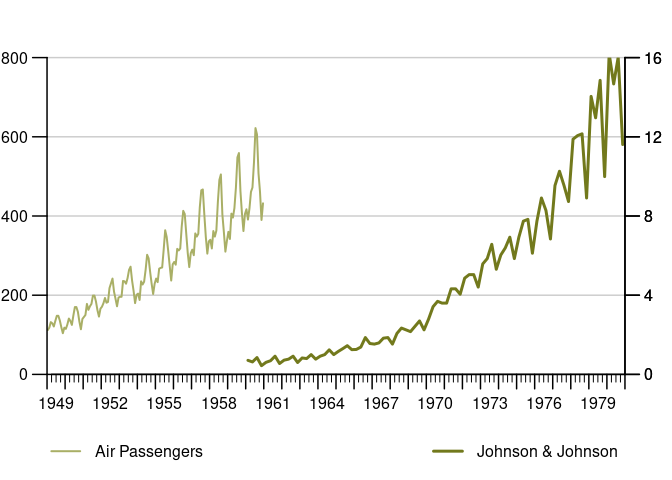

<!-- README.md is generated from README.Rmd. Please edit that file -->

# {tstools} – a Time Series Toolbox for Official Statistics

<!-- badges: start -->

[]()

[]()

[]()

<!-- badges: end -->

Plot official statistics’ time series conveniently: automatic legends,
highlight windows, stacked bar chars with positive and negative
contributions, sum-as-line option, two y-axes with automatic horizontal
grids that fit both axes and other popular chart types. ‘tstools’ comes
with a plethora of defaults to let you plot without setting an abundance
of parameters first, but gives you the flexibility to tweak the
defaults. In addition to charts, ‘tstools’ provides a super fast,
‘data.table’ backed time series I/O that allows the user to export /
import long format, wide format and transposed wide format data to
various file types.

## Installation

You can install the development version of tstools from
[GitHub](https://github.com/) with:

``` r
# install.packages("remotes")
remotes::install_github("mbannert/tstools")
```

## Example Use: Time Series Charts with Legends by Default

{tstools} lets you draw time series line charts that come with a legend
out-of-the-box. Simply feed the `tsplot()` function with a list of time
series.

``` r
library(tstools)
## basic example code
tsl <- list(
  AirPassengers = AirPassengers,
  JohnsonJohnson = JohnsonJohnson
)

tsplot(tsl)
```


and use easily use 2 y-axis. (I know some argue those double axes are
fundamentally flawed, but my peers didn’t care and asked for it.)

``` r
tsplot("Air Passengers" = tsl$AirPassengers,
       tsr =  list("Johnson & Johnson" = tsl$JohnsonJohnson))
```


